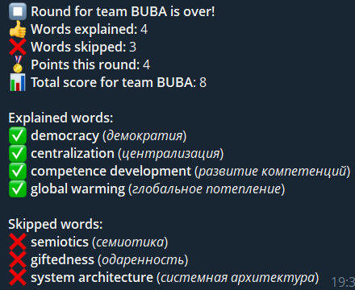
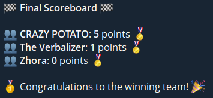

# 🗣️ talkfast-game-telegram-bot

A fast-paced, language-learning, party-packed **Alias-style game bot** for Telegram 🎉  
Written just for fun and perfect for practicing **German** and **English** vocabulary with friends or family!

---
## 🤖 Demo
**Round statistics**: 



**Final statistics**:



---

## 🤖 What is TalkFast?

TalkFast is a Telegram bot inspired by the board game Alias.  
It’s designed to:

- 🎯 Help you learn new words in German or English  
- 🧠 Train your brain with time-limited word explanations  
- 😂 Create chaos and laughter
- 👫 Be played in teams, with scoring, rounds, and victory conditions

Whether you're a language learner or just want a fun party game, TalkFast is here to help (and confuse) you 😁

---

## 🚀 How to Install Locally

> ⚠️ This bot is not currently hosted anywhere, so you’ll need to run it yourself (or host it on a cloud service or your own server).

### 1. Clone the repository

```bash
git clone https://github.com/Vitgracer/talkfast-game-telegram-bot.git
cd talkfast-game-telegram-bot
```

### 2. Set up the virtual environment

```bash
python -m venv talkfast_venv
talkfast_venv\Scripts\activate.bat  # For Windows
# or
source talkfast_venv/bin/activate   # For macOS/Linux
```

### 3. Install dependencies
```bash
pip install python-telegram-bot
pip install "python-telegram-bot[job-queue]"
```


### 4. Add your bot token
Create a **config.py** file and place it near **run_bot.py** file. Then write inside **config.py**:
```bash
BOT_TOKEN = 'your-telegram-bot-token-here'
```
Token can be requested from **BotFather**.

### 5. Run the bot 

```bash
python run_bot.py
```

## 🕹️ How to play
1. Use /start in a Telegram group or private chat with the bot.

2. Choose your language (German or English).

3. Select difficulty: 🟢 Easy, 🟠 Medium, 🔴 Hard.

4. Enter the number of teams (2 to 4), then name them.

5. Set the round duration (e.g., 60 seconds).

6. Set how many words are needed to win.

7. The game begins! One player explains, the others guess:

- ✅ Click **Understood** if the word is guessed.
- ❌ Click **Skip** to move on.

Points are awarded for explained words. The first team to reach the target wins! 🏆

## 📦 Word Packs
There are preloaded **.json** word packs for each language and difficulty:

- german_easy.json
- german_medium.json
- german_hard.json
- english_easy.json
- english_medium.json
- english_hard.json

You can add your own by modifying or extending these files.

## 💡 Ideas? Bugs? Contributions?
This project was made for fun and learning languages - just like the game itself 😄.
Feel free to fork, PR, or suggest improvements.